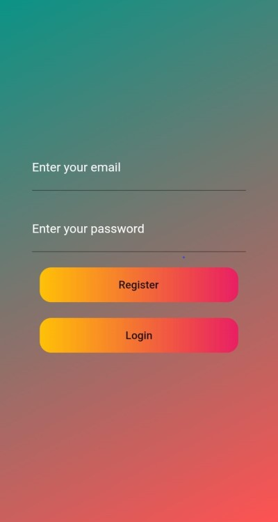
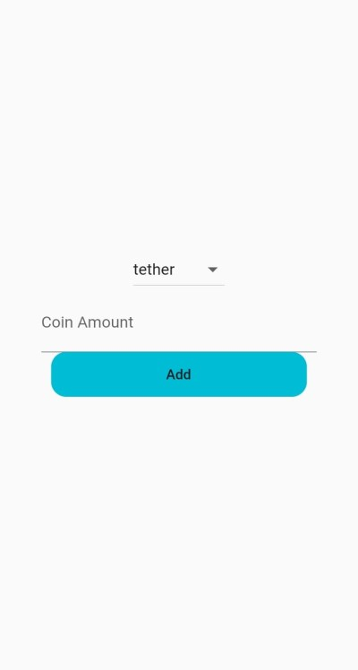
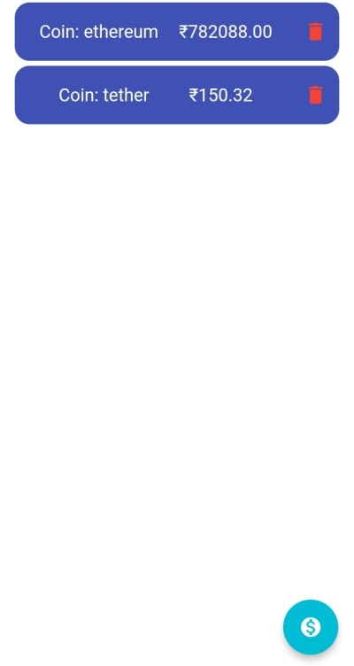

# Coin Nitro 💲

<p align="center">
   
</p>
<!-- PROJECT LOGO -->

[](https://GitHub.com/Naereen/StrapDown.js/graphs/commit-activity)

<!-- ABOUT THE PROJECT -->
## Built With
* **Frontend**
   -  Flutter
   -  Dart

* **Backend & Other Libraries**
   -  Firebase Auth
   -  Cloud Firestore
   -  Firebase Core

* **API**
   -  Coingecko API

*  **Database**
   -  Firebase
---

## ✨ Screenshots

| Authentication Screen |
| - |
|  |

| Coin Add Screen | Coin List Screen |
| - | - |
|  |  |

<!-- BUILT WITH -->  

## 📲 How to Install Locally

**1. Fork and clone this repository using**

   ```
   git clone https://github.com/soumyadeep6845/Coin-Nitro.git
   cd Coin-Nitro/
   ```  
**2. Read the API Documentation here**

   [Coingecko API](https://www.coingecko.com/en/api/documentation)

**3. Install the required dependencies using**  

   ```
   flutter packages get
   ```
   
**4. Connect any android device/emulator.** 

**5. Run and install the app, using**
   
   ```
   flutter run
   ```

**6. In case of general runtime difficulties, run**
   
   ```
   flutter clean
   ```
   and then,
   
   ```
   flutter packages get
   ```
   
**7. In case of null safety issues regarding latest versions of flutter, run**  

   ```
   flutter run --no-sound-null-safety
   ```
---

## Contributing

If you'd like to contribute, please **fork** the repository and then raise a PR with necessary changes. Thank you.

---

## 💚 Found this project interesting?

If you found this project useful, then please consider leaving a :star: on Github. Thank you 😄

---

## 👨 Project Maintained By-

* [Soumyadeep Das](https://www.linkedin.com/in/soumya0021/)
